I've done these posts for several years in a row, and this year as I sit down to write it out, there's a bit of a blank spot. 2018 was a pretty good year.

But why? Hah, and more importantly why should **YOU** care?? These posts aren't about the reader though, mostly, they are about the author and a way to reflect back and also consider the future.

Following the lead of my friends [Marisa](https://medium.com/@marisamorby/2018-retrospective-and-2019-action-plan-c30478bcc03d) and [Jason](https://lengstorf.com/2018-personal-retrospective), I'm going to use the retrospective format which is a review process that software/business types use to look back at how a project went.

1. What went well?
2. What didn't go well?
3. What will we change for the future?

# So, what went well?

Here's a little life tip, moving across the country and then immediately having your 5th kid 9 months later is not a sequence I would recommend or repeat.

Individually, both of these activities are intense. They literally disrupt every single aspect of your life, and force you into new and unexpected changes that you _cannot_ get out of.

It takes awhile to get back to any sense of normal after either of these events, and when they are stacked like that it might take a little longer.

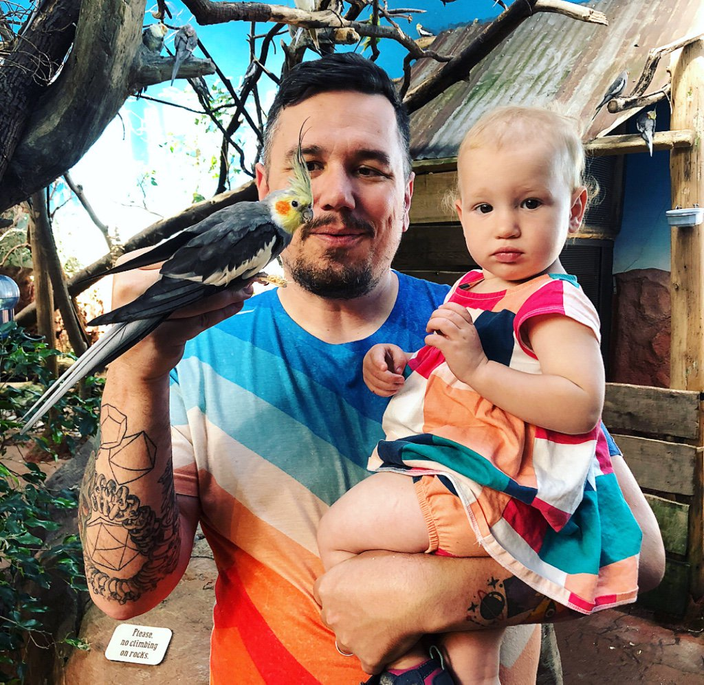

These dramatic changes affected the whole family, and 2018 felt like the year we collectively started to even out.

## Building habits and systems

In May I went to the dentist. It's only in recent years that I started actually going every 6th months. Most of my life I went sporadically, but I'm lucky the have strong enamel and didn't even have a cavity until I was 35. Since then, as one does as they get older, I've become more health conscious and would love to still have a set of original functioning teeth into my golden years.

The nice hygienist that cleaned my teeth described it as “going to war”.

So leaving, I decided that every day between then and my next visit I would floss my teeth for the first time in my life. (I’ve flossed before, just not as a habit)

And I did!

When I got back to the dentist in December a new hygienist asked be after a minute of inspection “so, how’s the flossing going?”

“How would you rate it?” I replied.

“Not good,” she said verbally stabbing my proud heart.

Lol.

Here’s the thing though, I’m still doing it. It’s just part of the daily routine. Just another Tuesday.

In fact, that small habit lead to me picking up a couple other habits, one at a time.

## Tracking my calories

I’ve tried a lot of different diets and approaches to weight loss over the years. Most of the ones that get hyped are radical and require significant lifestyle changes with regards to how you eat.

Luckily, I don’t have any pressing allergies or medical conditions that require me to eat a specific way.

I just like candy. A lot.

So instead of a restrictive diet that dictates what I can eat and/or when I can eat it, I’ve switch to using a calorie tracking app and simply logging what I eat.

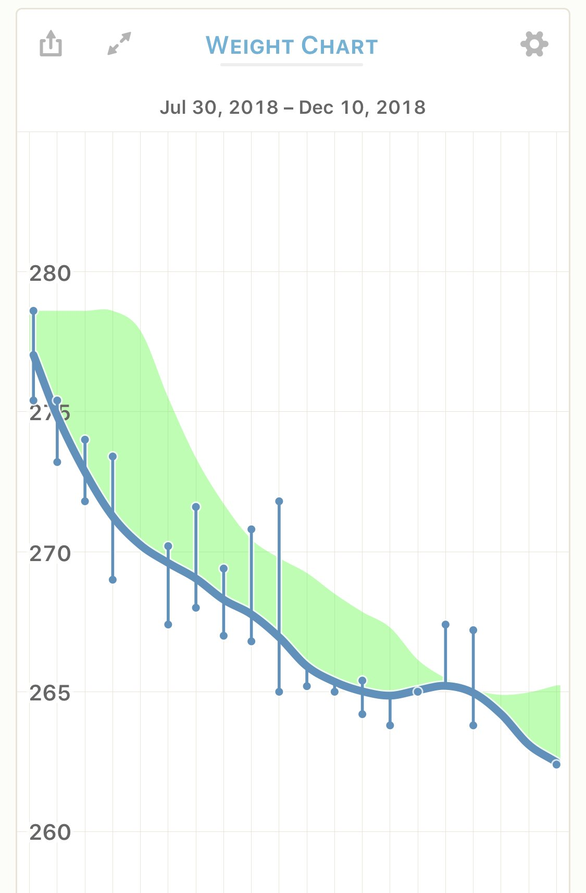

For me, this has been fantastic. I’ve dropped a few pounds, and have a better understanding of how what I eat affects me on a day to day basis. Definitely plan to keep this up throughout 2019.

## Lifting weights 🏋🏼‍♂️

The last time I lifted weights, or really did any sort of consistent rigorous physical activity was when I was 17, and even then it was mostly just doing curls to pump up my arms.

After having some success with tracking food, I decided that I would work out a bit. I’ve got a free weight rack in the garage that I had never used (the kids make use of it) so it was convenient to start.

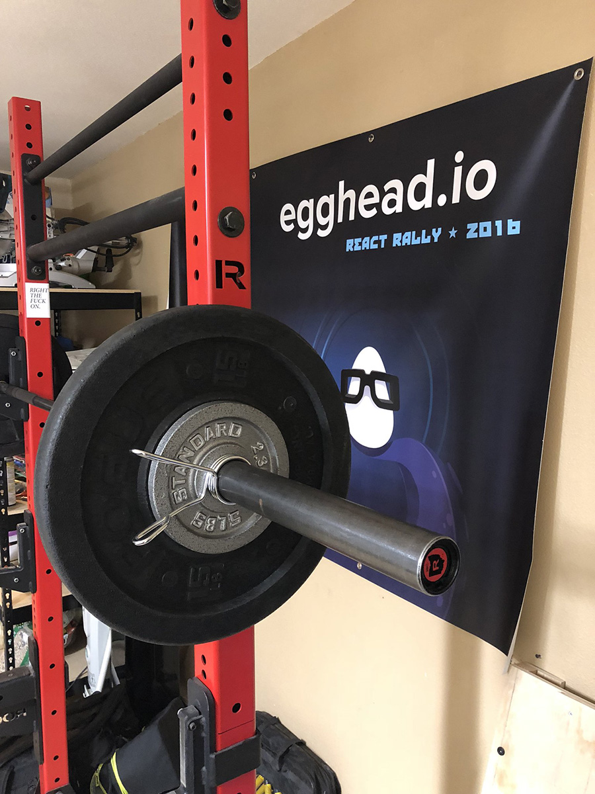

I used the 5x5 Stronglifts app on iOS to get started. It’s a simple program of 5 different lifts. You do squats, overhead presses, bench press, barbell rows, and dead lifts. The program starts you with just the bar, and stacks weight on to each of the exercises every time you encounter them.

Doing this 3x a week, I found the weights increased to heavy quickly, but I’m not trying to win any contests, and the worst outcome is getting injured so I did two things:

1. Slowed down the increments that the app adds weight
2. Dropped the weight 10% when it felt like my form was sketchy

This has had the effect of not being sore at all, progressively better form, and the workouts go relatively quickly.

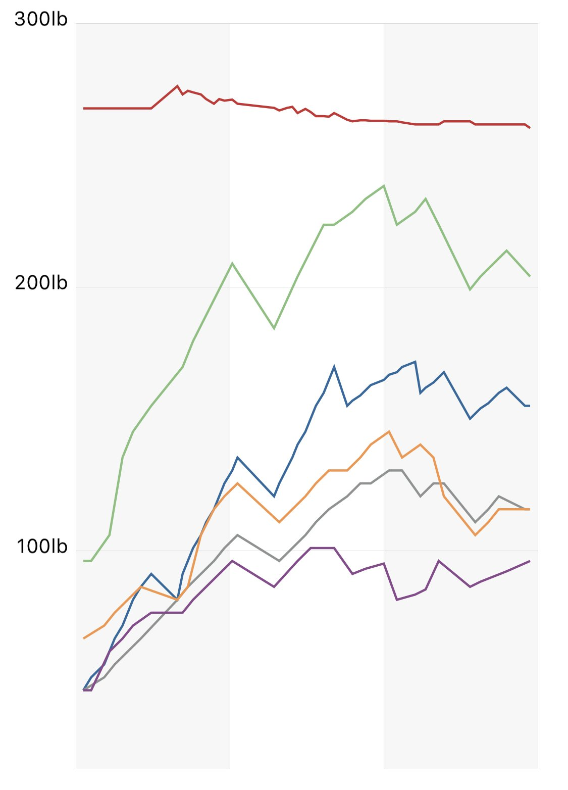

I personally love that there is no novelty or excitement in my workouts. Now they are just something I do. I still dread them a bit before I do them, but I haven’t missed much and when I do it is generally travel related.

When I get home, I start back up with 10% less weight.

My knees stopped hurting. My back feels way better, and I don’t get shoulder pain from “sleeping wrong” either.

All of these things I can attribute to both the weight loss and the weight lifting.

Looking forward to slow incremental progress as a weight lifter.

## One of the kids moved out 😭

This is bitter-sweet, but our oldest moved out and got an apartment with his partner.

What a big step. It’s nice to give one of the other kids their own room, but we miss having the full set around the house all the time.

## Started making friends

Moving across the country and having a kid throw a real wrench in your social life, but 2018 things started to perk up.

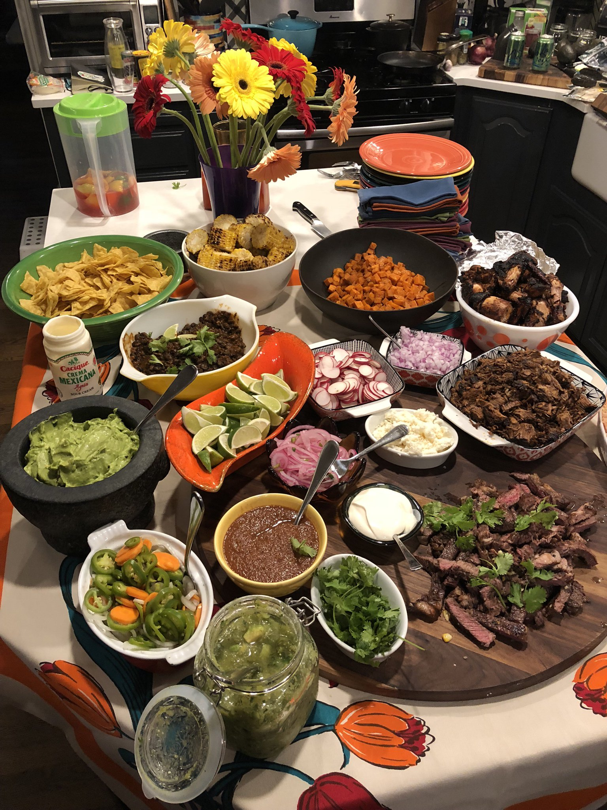

I threw a dinner party or two, got invited over for a dinner party or two, and had lots of great meals and conversations with friends.

It was nice.

## Made some art

Once again this summer I got to make the annual pilgrimage to learn from Joshua Davis. He taught a great workshop and I was as happy as I've ever been with the images that I created.

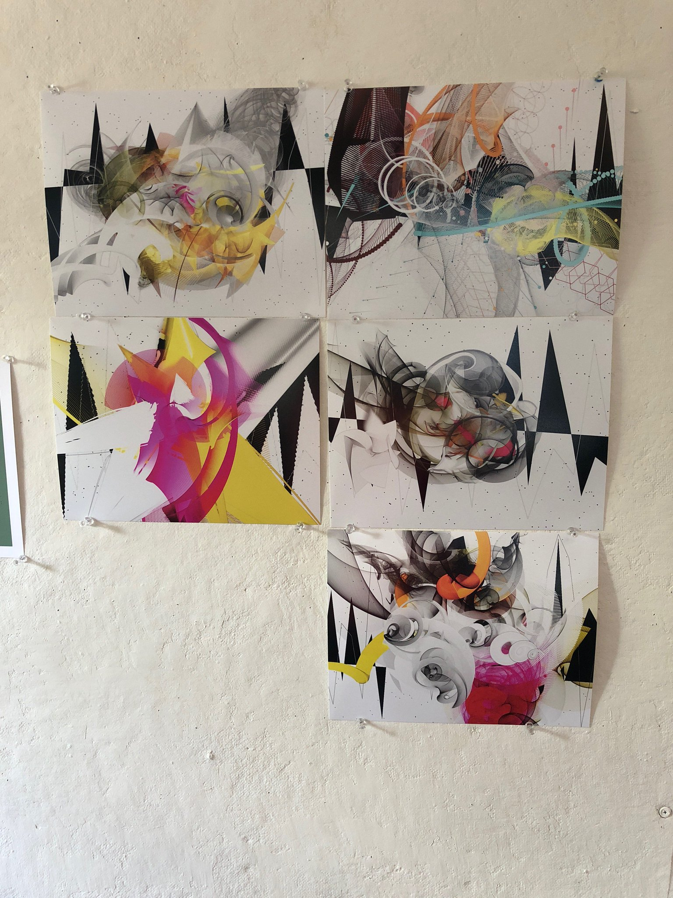

These were done in processing and used computer vision as the input so the camera on my laptop scanned the room watching for movement and color to affect changes on the variables that generate the imagery.

## Got to meet and hang our with my coworkers

Before September I’d never met the designer I work with on a daily basis in person.

We’d actually never even spoken. Hah

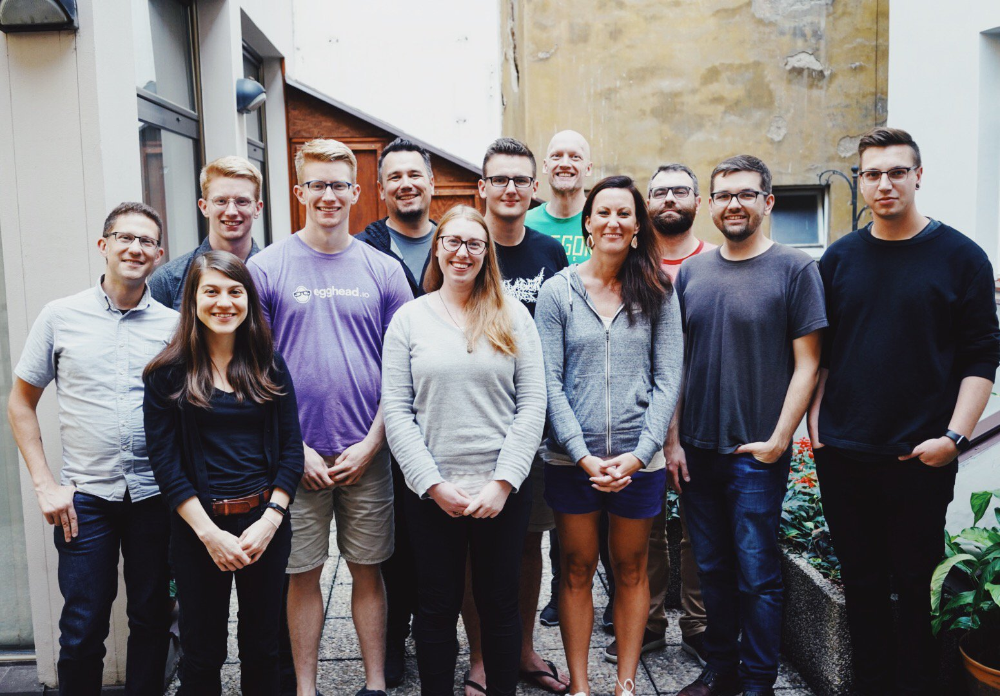

The internet, right??

We converged the entire company on Prague, and it was an awesome week of hanging out and getting to know one another.

## Launched a standalone product

We worked with Kent C Dodds in 2018 to produce and launch his [Testing JavaScript](https://testingjavascript.com) self-paced workshop.

We helped Kent at every step of the way and really pushed ourselves to produce something that everybody can be proud of.

It’s the start of a new line of business for us, and a way for the content creators that we work with to take their skills to a new level.

## Moved out of the home office

For the first time in a decade I don't work at home. For the last 10 years I've monopolized the dining room of our houses to get work done. This year I wanted to get that space back as well as provide some seperation between work and home so I rented a small office about 8 minutes from home.

It's been great actually. And the best part might be having the space back in our home for just chilling out and listening to records.

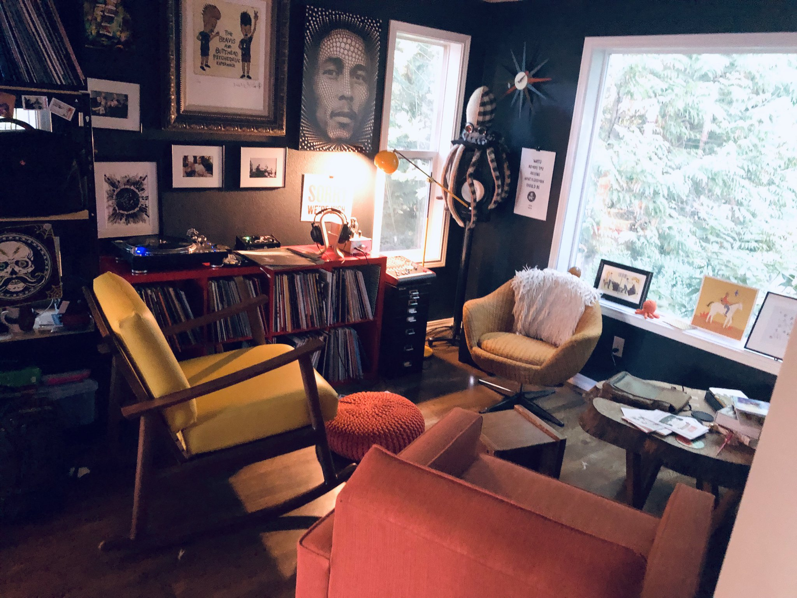

We enjoy it quite a lot.

## Several new tattoos

Well, once you get started, might as well go all in?

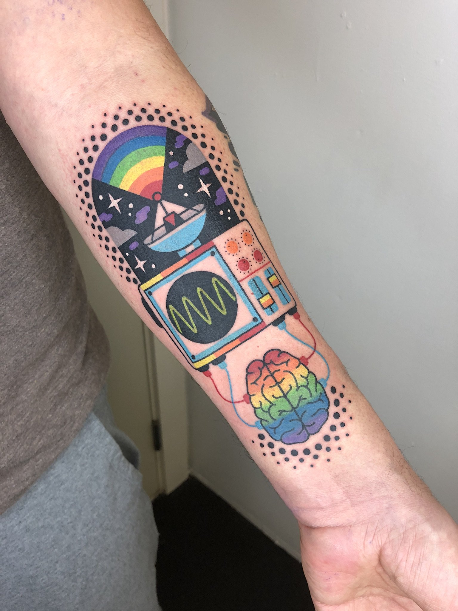

This one is from Winston the Whale in Portland. It is what it is ;)

This one is from Jiran of our three cats. Rat, the white one, actually passed away this year. Cyan pointed out that Comet, the orange cat, does NOT have a tail IRL. She says "It's OK, he'll be dead in a few years and we can just pretend."

WTF? lol

I just call him "not comet" and try not to think about it.

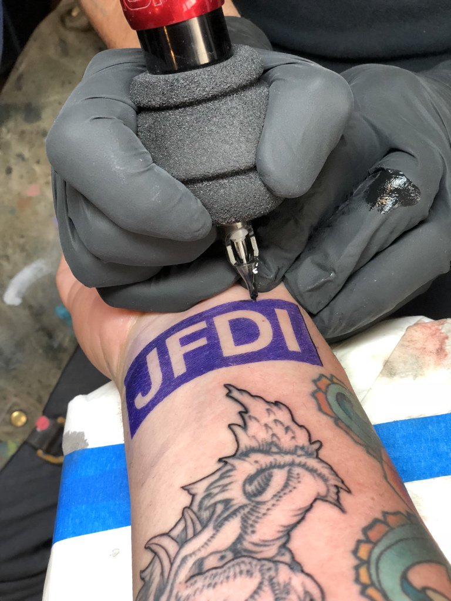

The JFDI means Just Fucking Do It, and is something that my friend Alex Hillman has had on his arm for years. I wanted a similar reminder for myself, and to point at the kids so I asked if he minded if I copied his tattoo.

So, there it is. JFDI. It’s a consistent and constant reminder to do the work.

# What didn’t go well?

At the beginning of 2018 I was enrolled in a woodworking class and bought a kickass Saw Stop table saw for the garage.

Built one thing.

Now it’s just a table sitting in the garage.

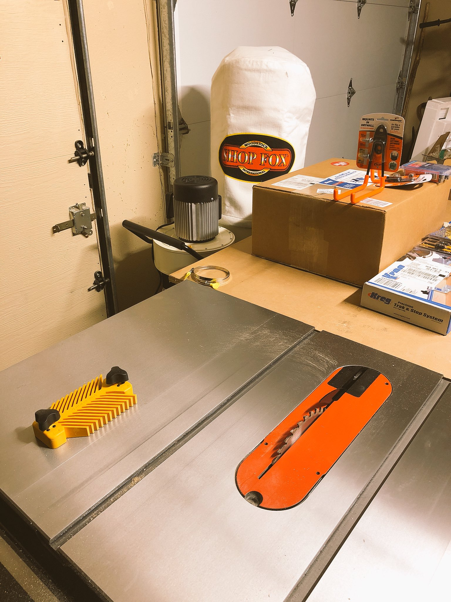

This is still something I want to do, but building a wood shop is a slippery slope. Space is limited. Need more tools… blah blah

Excuses!

## Mediocre Bullet Journaling

I really love the idea of Bullet Journaling as a system. It makes logical sense and it is functionally fairly easy to do.

It went really well for me right up to **the point where I really needed to be Bullet Journaling**.

That’s the point where I stopped doing it.

I felt productive af when it was going well though!

## Derailed from the plan at work…

At the beginning of 2018 we had a rock solid plan to aggressively pursue “enterprise” accounts for egghead.

In May we stopped pursuing enterprise accounts at egghead.

Managers want, almost universally, **whips and dashboards**. They want to know who is slacking off so they can punish/push them.

And I don’t want to participate. It’s not our goal.

So from that, the idea has been to pursue a richer individual learning experience and focus on upping the quality of the content and providing a way to assess that folks are actually learning.

That hasn’t really surfaced either, and overall it feels a bit like “spinning the wheels” as far as advancing or leveling up at the business.

Most days it feels like I’m making it up as I go along and that there are 10000 mini distraction that I get pulled into so I stop focusing on the most important aspects of what I need to be doing.

We’ve also been affected by slower growth overall as a business, so that has made it difficult to expand the team or make any headway on the very hard technical problems that I’d like to solve.

On one hand egghead has been a big success for me personally and professionally, on the other I feel desperately inadequate to sit at the helm.

# The focus for 2019

All in all I’m stoked for the new year. It doesn’t mean a new beginning or a new chance. I’m not one to make New Years resolutions, but the plan is relatively simple.

## Build a few things

I'd like to use the tools that I have in the house to build a few things. Simple stuff like bookshelves and cabinets that will be useful around the house.

Wood working is still interesting to me and I want to work out how to use the space and tools effectively. The shared space is difficult, but it doesn't have to be a deal breaker, especially for smaller projects.

## Continue to work on habits and systems

The plan is to work on the fundamentals. Tiny habits applied conssitantly.

Or universe is comprised of systems. Good ones and bad. I want to work on my own personal systems, the things I can control, to optimize them and make them run better.

Small improvements. Incremental change.

This year I want to add more small habits to my life, and stack the bricks in my favor both professionally and personally.

I want to work with great people. I want to build relationships and enjoy friendships new and old.

import { Tweet } from 'react-twitter-widgets'

<Tweet tweetId='1078000407014563841'/>

