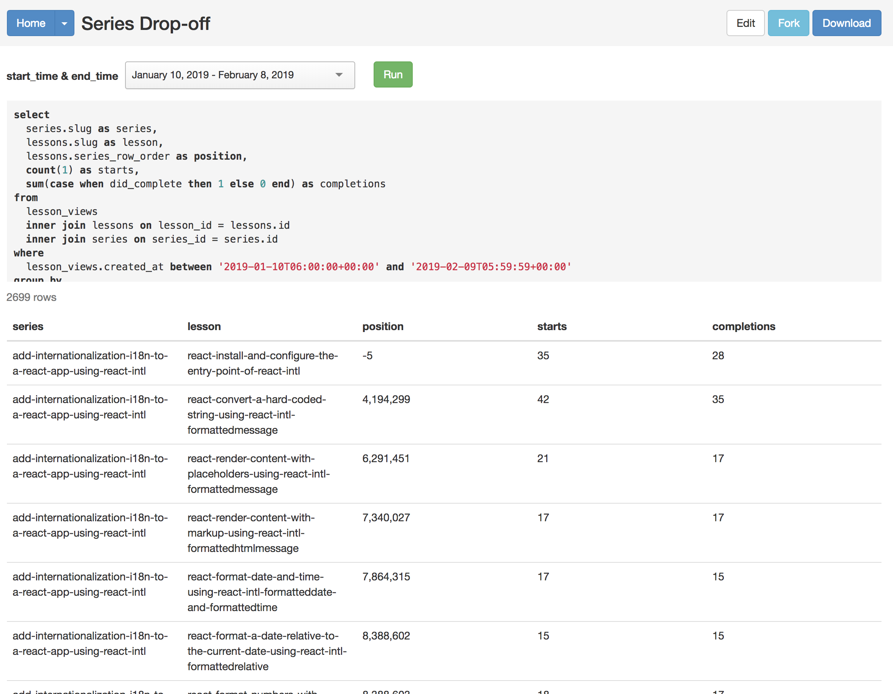

There are many ways to build a new feature for your applications. For me, when I need a new tool, component, or functionality I like to take a step back and think about it in terms of data. What data do I have, what data do I need, and how am I going to present and interact with the data.

At egghead, we are constantly working to improve our processes and the content that the creators we work are producing. One of the key performance indicators (KPI) we can look at to better understand how content is being consumed is dropoff rates.

When somebody sits down to watch a course they start lesson one. Sometimes they _don't even finish the first lesson_, sometimes they finish all the lessons, and then of course people stop at various points in between.

In a perfect world, most folks that start will also finish. We live in reality though, and as we start to seriously consider various aspects of our core format, we need to also consider how we will understand and **prove** that our improvement efforts are getting real results.

Otherwise you're just changing shit.

We track lesson views. We do this so we can persist progress for folks using the site, as well as part of our royalty payment system for our badass content creators. While all the data that we need to calculate dropoff rates is there in the database, it isn't presented in that format anywhere in our application.

We've got some options at this point:

- add api endpoints, data model changes, and UI to our existing rails app
- export some data and put together a lightweight presentation

I strongly prefer getting the data and working in a lightweight environment like codesandbox.io

It's faster and more disposable so I can iterate and explore solutions quickly. There's no build to deal with. Nothing needs to load over the wire. It's easy to share and collaborate.

Basically, it's great!

To get data out of our Rails application I have access to a gem called Blazer. It's an incredibly handy tool. You give it some SQL, define any variables, and it performs the query. You can look at the data in the browser, or download it as a comma-separated variable (CSV) file.



I grabbed the CSV.

My data has all the aspects I need. Each of the lesson videos that belongs to a "series" (course) is output with its position in the series, how many starts it has had, and how many completions.

The format is cumbersome though, so I am going to transform it with a node script.

This process is very similar to [what I did in this post](/export-drip-tags-for-convertkit)

Here's the full script, check it out and then I'll go through each section and explain what's happening:

```javascript
const _ = require('lodash')
const fs = require('fs')
const csv = require('csv-parser')
var reduce = require('stream-reduce')

const csvFilePath = './series-drop.csv'

fs.createReadStream(csvFilePath)
  .pipe(csv())
  .pipe(
    reduce((acc, row) => {
      const series = _.find(acc, { title: row.series }) || {
        lessons: [],
        totalStarts: 0,
        totalCompletions: 0,
      }
      const filtered = _.filter(acc, series => series.title !== row.series)

      return [
        ...filtered,
        {
          title: row.series,
          totalStarts: series.totalStarts + parseInt(row.starts, 10),
          totalCompletions:
            series.totalCompletions + parseInt(row.completions, 10),
          lessons: _.sortBy(
            [
              ...series.lessons,
              {
                title: row.lesson,
                starts: row.starts,
                completions: row.completions,
                position: row.position,
              },
            ],
            'position',
          ),
        },
      ]
    }, []),
  )
  .on('data', function(dropoffData) {
    fs.writeFile(
      'series_dropoff.json',
      JSON.stringify(dropoffData),
      'utf8',
      () => {
        console.log('done')
      },
    )
  })
```

Up top we have some imports.

- lodash: I love this library quite a lot and use it in every project. It provides an infinitly useful set of tools for dealing with objects and collections ❤️
- fs: this is part of the node standard library and is used for dealing with the file system. We are going to be loading a CSV and saving a json file, so it is required.
- csv-parser: this is a stream based library for consuming CSV data and converting it to JavaScript objects for each row/line of the CSV.
- stream-reduce: this is a reduce function for streams. Because I need to transform data from one "shape" to another, reduce is the tool I reach for.

To kick the script off the first step is to load the data:

```javascript
const csvFilePath = './series-drop.csv'

fs.createReadStream(csvFilePath)
```

We us `fs` to `createReadStream` which streams the data from the file on disk into our application.

```javascript
.pipe(csv())
```

Streams allow us to chain together steps. In the next step we `pipe` the data stream into `csv()` which converts the binary data stream into rows. The `csv-parser` library is powerful and can do more interesting things, but luckily for us we don't need to do anything interesting so we can just call `csv()` and have what we need.

```javascript
.pipe(
  reduce((acc, row) => {
    //we'll look at this part later...
  }, []),
```

We are calling `pipe` again, and this time we are piping the _result_ of the previous step that converts our file on disk into JavaScript data objects into a `reduce` function. If you aren't familiar with reduce, or want to dig a bit deeper, I highly recommend [mykola bilokonsky's awesome egghead course](https://egghead.io/courses/reduce-data-with-javascript-array-reduce) on the topic!

The reduce function takes two arguments.

1. the reducer function. This function also takes two arguments. The _accumulator_ and the current item. Reducers typically work on collections or objects. Things that can be iterated on. It's similar to a `forEach` or `map`, but the accumulator is what makes the reducer interesting.
2. The second argument is the starting state of the accumulator. In our case we want to reduce all of the rows in our CSV file into an array of javascript objects that each represent a course so this second argument is a `[]`

```javascript
reduce((acc, row) => {
  const series = _.find(acc, {title: row.series}) || {
    lessons: [],
    totalStarts: 0,
    totalCompletions: 0,
  }
  const filtered = _.filter(acc, series => series.title !== row.series)
```

Inside of our reducer we want to take the current row and add the lesson data to the series object. We use `_.find(acc, {title: row.series})` to see if the accumulator already has an object for this series. If it doesn't we create an object to work with and assign it sensible defaults.

We also create another array that filters out the existing series object so that we don't end up with doubles.

```javascript
return [
  ...filtered,
  {
    title: row.series,
    totalStarts: series.totalStarts + parseInt(row.starts, 10),
    totalCompletions: series.totalCompletions + parseInt(row.completions, 10),
    lessons: _.sortBy(
      [
        ...series.lessons,
        {
          title: row.lesson,
          starts: row.starts,
          completions: row.completions,
          position: row.position,
        },
      ],
      'position',
    ),
  },
]
```

Our reducer function returns _a new array_ that becomes the `acc` accumulator for the next row.

We spread the filtered array `...filtered` so that all of the items in that array are in our new array. Then we add a new object that represents the current row series into the array.

Notice we didn't _mutate_ any data. We built a new array to return as our new accumulator.

```javascript
{
  title: row.series,
  totalStarts: series.totalStarts + parseInt(row.starts, 10),
  totalCompletions:
    series.totalCompletions + parseInt(row.completions, 10),
  lessons: _.sortBy(
    [
      ...series.lessons,
      {
        title: row.lesson,
        starts: row.starts,
        completions: row.completions,
        position: row.position,
      },
    ],
    'position',
  ),
}
```

This is the new (or updated) series object. It sets the title, adds the current row's `starts` and `completions` to the previous count (we set it to 0 if it's a newly accumulated series), and finally we add the lessons.

```javascript
lessons: _.sortBy(
  [
    ...series.lessons,
    {
      title: row.lesson,
      starts: row.starts,
      completions: row.completions,
      position: row.position,
    },
  ],
  'position',
)
```

The lessons get added with `sortBy` from lodash, which sorts an array based on the second argument. In this case we just pass the string `'position'` which tells lodash to sort on the position property of the objects in the array.

Inside of `sortBy` we use `...series.lessons` to spread any existing lessons in the accumulated series back into the new series object. Then we can add the data from the current row as a new lesson into the accumulated series object.

This part gets a little weird if you aren't used to reducers and (re)building objects using the `...` spread operator, but it's worth practicing and thinking about because it is a very useful tool. If you'd like a really great explaination of this, I highly recommend [this egghead video from Dan Abramov](https://egghead.io/lessons/react-redux-avoiding-array-mutations-with-concat-slice-and-spread).

To get a clearer picture of what just happened, we have reduced/transformed this csv data:

```csv
add-internationalization-i18n-to-a-react-app-using-react-intl,react-install-and-configure-the-entry-point-of-react-intl,-5,530,428
add-internationalization-i18n-to-a-react-app-using-react-intl,react-convert-a-hard-coded-string-using-react-intl-formattedmessage,4194299,498,370
add-internationalization-i18n-to-a-react-app-using-react-intl,react-render-content-with-placeholders-using-react-intl-formattedmessage,6291451,305,233
add-internationalization-i18n-to-a-react-app-using-react-intl,react-render-content-with-markup-using-react-intl-formattedhtmlmessage,7340027,259,234
add-internationalization-i18n-to-a-react-app-using-react-intl,react-format-date-and-time-using-react-intl-formatteddate-and-formattedtime,7864315,244,210
add-internationalization-i18n-to-a-react-app-using-react-intl,react-format-a-date-relative-to-the-current-date-using-react-intl-formattedrelative,8388602,201,192
add-internationalization-i18n-to-a-react-app-using-react-intl,react-format-numbers-with-separators-and-currency-symbols-using-react-intl-formattednumber,8388603,216,197
add-internationalization-i18n-to-a-react-app-using-react-intl,react-render-content-based-on-a-number-using-react-intl-formattedmessage,8388604,203,174
add-internationalization-i18n-to-a-react-app-using-react-intl,react-use-a-react-intl-higher-order-component-to-format-messages-and-get-current-locale,8388605,251,199
add-internationalization-i18n-to-a-react-app-using-react-intl,react-write-tests-for-react-intl-output-using-enzyme-and-jest,8388606,242,144
add-internationalization-i18n-to-a-react-app-using-react-intl,react-use-webpack-to-conditionally-include-an-intl-polyfill-for-older-browsers,8388607,187,154
```

Into a nicely structured JS object like this:

```json
[{
  "title": "add-internationalization-i18n-to-a-react-app-using-react-intl",
  "totalStarts": 3136,
  "totalCompletions": 2535,
  "lessons": [
    {
      "title": "react-install-and-configure-the-entry-point-of-react-intl",
      "starts": "530",
      "completions": "428",
      "position": "-5"
    },
    {
      "title": "react-convert-a-hard-coded-string-using-react-intl-formattedmessage",
      "starts": "498",
      "completions": "370",
      "position": "4194299"
    },
    {
      "title": "react-render-content-with-placeholders-using-react-intl-formattedmessage",
      "starts": "305",
      "completions": "233",
      "position": "6291451"
    },
    {
      "title": "react-render-content-with-markup-using-react-intl-formattedhtmlmessage",
      "starts": "259",
      "completions": "234",
      "position": "7340027"
    },
    {
      "title": "react-format-date-and-time-using-react-intl-formatteddate-and-formattedtime",
      "starts": "244",
      "completions": "210",
      "position": "7864315"
    },
    {
      "title": "react-format-a-date-relative-to-the-current-date-using-react-intl-formattedrelative",
      "starts": "201",
      "completions": "192",
      "position": "8388602"
    },
    {
      "title": "react-format-numbers-with-separators-and-currency-symbols-using-react-intl-formattednumber",
      "starts": "216",
      "completions": "197",
      "position": "8388603"
    },
    {
      "title": "react-render-content-based-on-a-number-using-react-intl-formattedmessage",
      "starts": "203",
      "completions": "174",
      "position": "8388604"
    },
    {
      "title": "react-use-a-react-intl-higher-order-component-to-format-messages-and-get-current-locale",
      "starts": "251",
      "completions": "199",
      "position": "8388605"
    },
    {
      "title": "react-write-tests-for-react-intl-output-using-enzyme-and-jest",
      "starts": "242",
      "completions": "144",
      "position": "8388606"
    },
    {
      "title": "react-use-webpack-to-conditionally-include-an-intl-polyfill-for-older-browsers",
      "starts": "187",
      "completions": "154",
      "position": "8388607"
    }
  ]
},
...
]
```

All that's left is to write it out to a file so we can use it elsewhere:

```javascript
.on('data', function(dropoffData) {
  fs.writeFile(
    'series_dropoff.json',
    JSON.stringify(dropoffData),
    'utf8',
    () => {
      console.log('done')
    },
  )
})
```

Streams can listen for standard events. In this case we are listening for `data` which is ommitted by `stream-reducer` when it is done. We can then use `fs.writeFile` to write out our reduced array of series objects to disk!

Armed with well formated data it was a lot easier to open up codesandbox and start playing with it. I ended up choosing react-charts and a bargraph.

<iframe
  src="https://codesandbox.io/embed/6jj1kr8lxk?autoresize=1&hidenavigation=1&module=%2Fsrc%2FChart.js&view=preview"
  style="width:100%; height:500px; border:0; border-radius: 4px; overflow:hidden;"
  sandbox="allow-modals allow-forms allow-popups allow-scripts allow-same-origin"
/>

Feel free to explore the codesandbox to see how the data gets used to create a chart.

If you'd like to watch me stumble around and figure this all out in realtime, today's your lucky day. I recorded it all and [posted it to this playlist](https://www.youtube.com/playlist?list=PL1g0o_QdVLU_PPf_tf5QPMJpXLcn_Xy5j). 🙂
