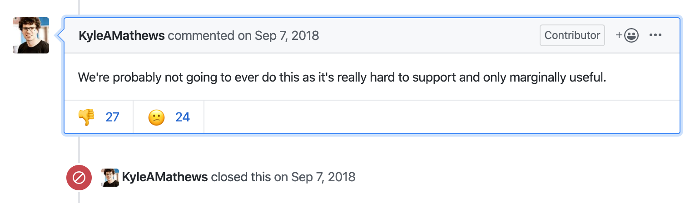

We've got a robust Rails app that does a lot of heavy lifting for us. We've crafted a full hateos REST api with a delightful GraphQL layer over the top.

We started using React as our primary UI a few years ago, and we do SSR via React on Rails. It's a great project and our pages are pretty fast. They are rendered by running a little node server sidecar with our Rails app. There's some caching involved and it is "fine"


The experiment is running here: https://egghead.io/learn

Our Rails app is private, but you can see the Gatsby app [here](https://github.com/eggheadio/egghead-static). This app has our entire catalog as JSON files. Eventually it'd make more sense to have these generated at build time or by the server and saved to an S3 bucket.

Cloudfront Behaviors are the secret sauce. We already use Cloudfront to cache our entire site, and behaviors let define specific route paths and point them to any origin server we like. It works essentially like a CNAME in DNS, but also reminds me of a proxy with nginx or Apache.

Since we use Heroku primary for our primary app and are pretty happy with it, using the proxy approach wasn't as sensible. You can to fun nginx ✨tricks✨ on heroku too with buildpacks, but Cloudfront behaviors felt lighter and just kind of worked so I went with it.

On the netlify side everything is relatively normal in terms of configuration. We pointed the Cloudfront Behavior to an origin that is the netlify sub-domain.

This threw a wrench in the works. Gatsby doesn't allow configurable build directories and [Kyle says it will **never** allow us to configure build directories](https://github.com/gatsbyjs/gatsby/issues/1878#issuecomment-419614298) so we needed to use a different solution. A painful sad solution 😭



I agree. We are at the margins here, but at the same time this feels like a powerful use case that could sell Gatsby as a powerful modern tool that fits nicely and plays well in existing legacy application infrastructures.

Hacks are fine though 😂

We just configured an npm script in our `package.json` to clear the build folder, build the app, create a sub-folder, and move the whole fuckin build manually into the sub-folder.

This step took the most debugging to get the clearing and recursive moving working properly, but configurable Gatsby output folders are very hard and marginally useful so here we are!

```json
"build": "rm -rf public && gatsby build --prefix-paths && yarn move",
"move": "cd public && mkdir learn | mv * learn",
```

This isn't the worst config code I've ever written, but the Gatsby build is a predictable linux environment and this works. We also need the Gatsby `pathPrefix` option set in out config set to `learn`

The whole setup is flimsy, but the result is super interesting. Now we have a blazing fast Gatsby app that has full and complete authenticated access via a Rails session to our API.

It opens a lot of questions, but also opens up a huge pile of potential.Our catalog doesn't change rapidly so we can deal with build times required for static approach. The vast majority of the metadata for our entire catalog can be static. As far as protected content, it's mostly related to media access and that's a small percentage of the overall data and very fast to load async.

React concurrent mode and Suspense is going to be a huge win for this approach, since each page on the site will be 90% static with the rest being filled in.

