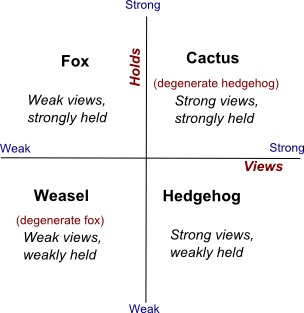

We've been testing Basecamp at egghead.

**[2021-01-01 Update]**: _Basecamp didn't work out for us, and we ended up back on Slack for most day-to-day discussion and Roam for async co-thinking/planning._

So far, it feels like a great tool to add to our general practice and hits a lot of sweet spots in terms of task and project management.

We've got a few projects moved over and live in Basecamp, and in 2020 we will consider more deeply how this site fits into our workflow. I'm personally interested in figuring out a more consistent transparent process for getting work done at egghead. 

I'm reading [Ryan Singer's Shape Up](https://basecamp.com/shapeup) to see how they work at Basecamp, which I assume includes this tool.

We tried to use Notion as an all-in-wonder solution for our production projects and it felt like it was bursting at the seams.

Notion is an *excellent* relational wiki. It creates nice shareable pages and dashboards, and the "no-code" database to organize notes and media is great. 

Our video and notes archives in Notion blow my mind 🤯

Airtable, Roam, Fibery, and Notion are all examples of this space. They all have interesting ideas and approaches. Wired for exploration and connection. Building knowledge graphs.

It's going to be fun to watch how this space evolves over the next several years.

My current primary qualification for these tools is seamless and complete export abilities 😂

I'm excited about Tiago Forte's [Progressive Summarization](https://praxis.fortelabs.co/progressive-summarization-a-practical-technique-for-designing-discoverable-notes-3459b257d3eb/) and [Second Brain](https://www.buildingasecondbrain.com/). 

Notion seems like a great solution for now in this area. Particularly for teams attempting a second brain. It's a shared relational filesystem for documents.

Tiago is starting to migrate to Notion so there should be great materials as well.

In the Second Brain, Tiago talks about using the full ecosystem of tools at your disposal, but keep the taxonomy (PARA, projects, areas, resources, archives) consistently named across systems. So a project in basecamp would have similar names in Notion, DropBox, Trello, etc.

Tiago also talks about the idea that we aren't looking for perfection in these systems. What we are looking for is the consistent incremental improvement of our process. Collective grooming. Communication. Conversation. Collaboration.

One of my critiques of Second Brain, PARA, etc is that the material is very focused on the individual. This is appropriate because productivity, getting shit done, is personal. At the task level, we need the freedom to organize for ourselves in a way that makes sense to us so that we can feel comfortable and effective.

A mistake of group process in my observation is trying to make it homogonous and forcing everybody into the same productivity pipeline.

It makes sense, it's way easier to manage if everything is the same. In theory, you always know what's going on. Where everything is. The current status.

In practice, everything can be linked, refined, and we can progressively summarize the opaque personal layers into shared spaces, choosing the most appropriate medium and context for what we are trying to accomplish.

* **Github** is directly in the code. Issues, PRs, README, and documentation 
* **InVision** is appropriate for design discussion
* **Notion** is a relational information database, a wiki. It makes it easy to write, connect, and share information and content. A shared file system for documents.
* **Slack** is great for chatting in realtime. A watercooler. Community.
* **Basecamp** for projects and team chat. Getting shit done. Sharing progress, deadlines, milestones, and todos
* **Front** is for support and conversation. Email still has a place 🖤
* **Dropbox** is for shared media (video, audio, pdf, etc)
* **howtoegghead.com** is a hand-curated public set of guides that describe how we work at egghead.
* and a boatload of smaller tools like Whimsical, codesandbox, and others that are more niche but valuable.

These systems all have something in common. 

You can create and share URLs across them all. 

In any of these information contexts, we can make connections.

Using the right tool for the job makes sense. Trying to cram all of the solutions to all of the information contexts we have as a business into a single tool lands you at one thing.

Jira

Instead, we've spread out. We have the freedom to use any tool we want. We can explore the boundaries. We can define our personal approach to day to day productivity and surface that work across a more limited set of collaborative channels.

The cost of this is more chaos. 

Entropy 😧

It reminds me of vgr's [Cactus and Weasel](https://www.ribbonfarm.com/2014/02/20/the-cactus-and-the-weasel/)

This 2x2 puts egghead most certainly in the Fox quadrant and the way we organize our work is more in tune with many small purpose-built tools. The Hedgehog uses Jira or something similar that can be tamed and under one roof.

Neither approach is bad. Just different. 

What's missing at egghead?

Ownership. 

When everybody owns everything nobody owns anything.

Figuring out how to define and present the idea of who is responsible for what can make a huge difference, reduce stress, and enhance transparency across an organization.

* Who is responsible for this?
* When do we communicate?
* How do we communicate?
* Where do we communicate?
* What's the next step?
* When is this done?
* Who needs to know about it?

These are important questions. They can all be answered. The primary theme is communication, and ultimately that's what "ownership" means at egghead. The owner facilitates communication, surfaces knowledge, and makes sure we know the answers to these questions (and questions like them).
