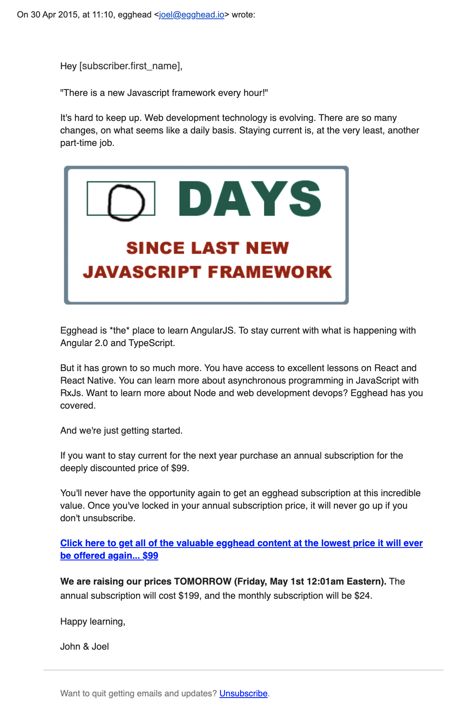
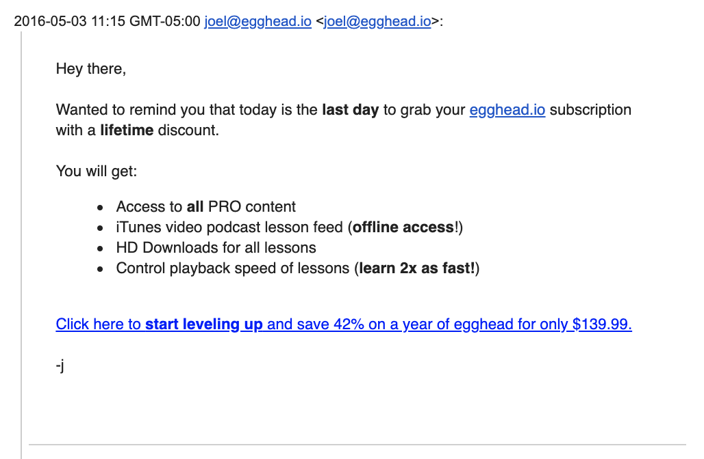

We crossed the $16M milestone on 2019-12-05, and I've been staring at the little charts Stripe shows on the dashboard. 

For the first two years we were really trucking along. The new customers metric is interesting. You see it growing at a steady clip and then two years in a row in April it just totally shits the bed.

New members just dropped in May, and start trickling in.

Looking back, that was the month we decided to charge more for the service, doubling the annual price of the service from $99 to $199.

Here we re again in 2016 with a killer sale with a cheeky 42% discount, a huge spike in sales, and then a trough.

After that it's off to the races when we run our first "12 Days of Giftmas" holiday event, a shorter event in late April, and repeated that through today where our third annual advent style promotion is now running.

The charts look violent, and I had a very negative reaction to the trough after the 2016 April promotion thinking I'd broken the business.

This chart gives a clearer picture of the 6 years. While the volume of new customers has steadily dropped, the overall revenue per customer has increased with our pricing increases (currently it's $350/year and $40/month).

We rely on these deep discount sale events and that bothers me a little. The holiday event is fun, but this year in particular it was a lot of work! We started planning in July. The timing was good because it let us get some serious reps in our revamped production processes, but it was a slog.

The original run in 2016 was convenient because we happened to have over a dozen finished courses in the queue 😂