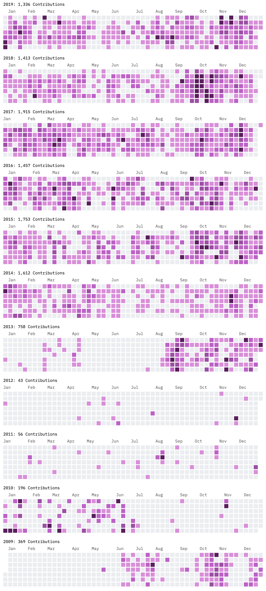

Below is a chart that represents 10 years of concentrated effort.

I started using Github in 2009, which was also the year that I landed my first full-time coding gig. 

[robotlegs](https://github.com/robotlegs/robotlegs-framework) was the project I worked on and contributed to heavily for a full year. It was a ton of fun, great tech, and I owe so much to the other amazing people involved in that effort. ❤️

Then it all stops and there is a period from 2010 through 2013 where I barely contributed any code to Github. That's when I went to work as a consultant and most of the work was behind corporate firewalls and committed to SVN.

In August of 2013 my contribution graph really heats up! 🔥

That's when I started working on [egghead.io](https://egghead.io/s/dtccr) which is what I've been doing for the 6 years since.

_the chart was created with [this generator](https://github-contributions.now.sh/)_

