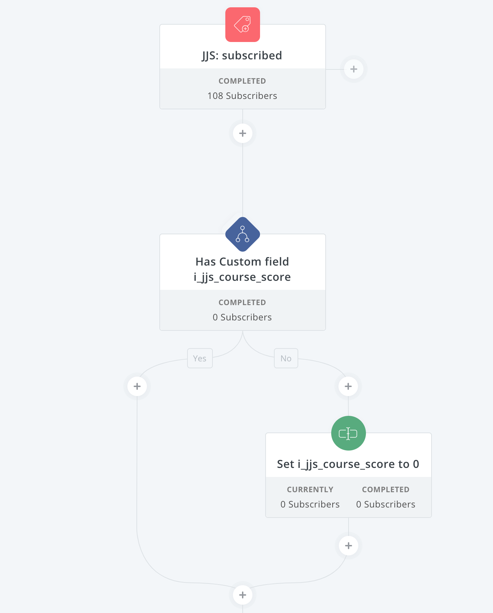
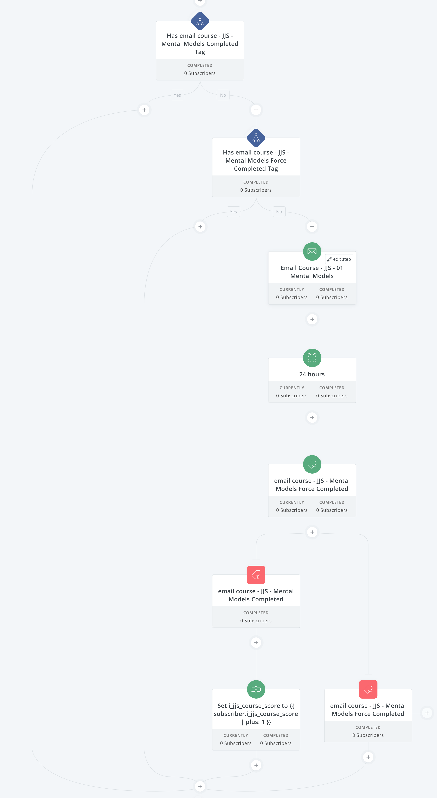
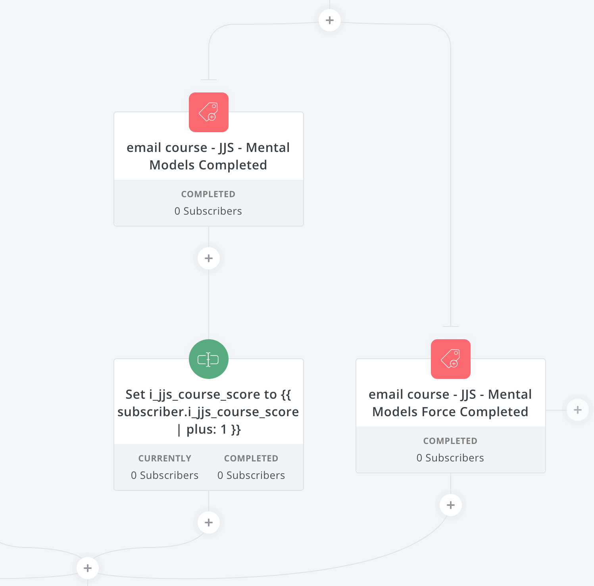

We (egghead) partnered with Dan Abramov and Maggie Appleton to help produce their online course Just JavaScript that explores the foundational mental models that surround JS as well as how those same mental models apply to programming in general.

Dan's been thinking about these mental models for years and has been meeting with Maggie regularly to explore a visual presentation of the models and metaphors that he's been considering as a way to teach JavaScript to newcomers and experienced coders alike.

The project is ambitious, and the end goal is to push the envelope of what and how we teach programming on the internet heavily inspired by the work of [Bret Victor's ideas](http://worrydream.com/LearnableProgramming/) as well as [recent work by Andy Matuschak and Michael Nielsen](https://quantum.country/). 

Just JavaScript is meant to be fun and interesting without being condescending or fluffy!

That's a tall order, and like most things one of the hardest parts is where to even start.

Is this a "classic egghead course"?

Is this a book?

Is this a blog?

"Yes" is the cheeky answer, it's all those things and more, but that doesn't help us start shipping and releasing to real users for feedback and development of the final product.

In terms of our own mental models for how to start releasing the work, we came to the conclusion that this is essentially a "book" to start out. It's a familiar structure and something that all three of us can agree upon in terms of how to produce the initial "chapters"

But we don't want it to live on a webpage yet and we aren't developing for print, so the question is how will we deliver the content to eager users, create a feedback loop, and start the initial development of a high quality email list of engaged learners that might also be interested in buying the final product.

To accomplish this we went with the idea of a self-paced email course, which is an idea that I learned from [Brennan Dunn's in depth ConvertKit Masterclass](https://createandsell.co/courses/mastering-convertkit?ref=joelhooks).

With a traditional email course a user subscribes to the course and then the emails are sent at a given pace, once per day/week/etc. This is fine, but the problem is that people often want to learn more right now and when somebody is in the mood to learn, we want to help facilitate that.

The idea of "self-paced" means that the subscriber can perform some action that will trigger the next email to be sent.

Because we are very interested in assessment and giving learners a sense of proof that they understand the concepts, we wanted to add quiz-like exercises at the end of each module.

We considered several approaches ranging from a bullet list of "trigger links" inline in the emails to building a bespoke quiz system (Dan, Maggie, and I can all code so the temptation to build a custom thing is strong hah).

In the end, we decided to use TypeForm which is a relatively robust survey tool that has most of the features we wanted for a quiz built-in.

It's **far from perfect** and ultimately we will be creating something more tuned to the needs of our project and the learners that are using it, but here's the secret:

### TypeForm meant that we could stop talking and start fucking shipping valuable lessons to our users.

🤩

So we've got the essential pieces:

* content
* exercises

The final piece that we were missing was a way to connect the content and exercises in a way that triggered the completion so the user would get the next module emailed to them right away.

That was pretty simple to accomplish using Zapier which is a tool that listens for events to occur and allows you to trigger actions on services based on those events.

In our case, we add a link at the bottom of the emails that sends the user to TypeForm with their email address as a parameter of the URL. Once they complete the quiz their response is emailed to us and it triggers a Zapier task that looks them up in ConvertKit and tags them with a "completed" tag for the lesson.

If they do nothing at all the next email in the sequence is sent to them in 24 hours so that they don't miss out.

In the first month of this self-paced email course going live, we added over 30,000 people to the email list and have an average open rate well above 50% with thousands of completed exercises and hundreds of valuable replies containing feedback that we've used to tune the course for clarity and understanding.

All of this will be used to craft an incredible experience when the course is released for sale in the future and ensures that the product is of the highest quality as we can manage without compromise.

## ConvertKit Automation

[ConvertKit](https://convertkit.com?lmref=ia534A) provides powerful automations that we can use to produce this course and make it flow smoothly. While powerful, CK automations can also be aggravating, prone to error, hard to test, and easy to fuck up in general lol. I'm going to give a quick review of how we managed this but I highly recommend [Brennan's course](https://createandsell.co/courses/mastering-convertkit?ref=joelhooks) as it goes into much more depth.

### Setting a Score

ConvertKit automations are triggered by events or changes in user properties. In our case, the primary trigger is when somebody subscribes to the form on [JustJavaScript.com](https://justjavascript.com).

When they subscribe ConverKit sends them a confirmation email (always use double opt-in!) that they need to open and click.

Not that I **always set up custom landing pages** for both the url after they subscribe that the form redirects to as well as the url they land on when they confirm, otherwise they get default ConvertKit pages which are fine I guess if you don't mind them (I do mind them so I take an extra 30 minutes and make things nice)

Once they subscribe we immediately set a "score" property on the subscriber.

The first step in the automation checks to see if they have the score property set, and if they don't it sets it to zero so that we can do math on it later and not get an error.

Since this course is a work in progress we have to consider that the user will actually **start the automation** many times so that's why we are doing the check and then initializing the value instead of just initializing the value to 0 which would reset the score every time the user cycles through the automation.

### Sending a module

This course will have many modules. We aren't positive how many when we start so the entire thing is built to be repeatable and allow for us to send subscribers through many times.

While the content of each module is different the actual steps in the automation are the same and look like this:

Here we are checking if the user as `completed` or `force completed` the particular module. If they have these tags, we skip the module and move on to the next (which has the same checks and structure).

If they haven't completed the module we add them to the modules email sequence.

Unfortunately, ConvertKit doesn't allow you to send single emails inside of an automation, so we are using sequences that aren't sequences and only send one email.

The sequence is one email and the initial delay is set to 0 which means it sends immediately.

In ConvertKit, when a sequence is within an automation the user **exits the sequence immediately** after the final email is sent so in our case that means they return to the automation immediately where they encounter a `24 hour delay` node.

If the subscriber does nothing at all when the 24 hour delay finishes, they get the `force completed` tag applied.

When you add an event node inside a ConvertKit automation it does a couple of things:

* stops the flow of the automation so that if the event is never triggered the subscriber just sits there forever in front of the event
* pulls the subscriber to the event if it is triggered and they are inside of the automation above the event

So if the user does nothing and the 24 hour delay is up, they get the `force completed` tag added and are pulled to the `force completed` event node and sent downstream through the automation.

If the subscriber clicks the Typeform link in the email and completes the quiz however they trigger the Zapier task which tags them as `completed` for this module and **immediately skips past the delay** to the completed event node.

Inside of that branch we also update their score property with a plus 1 so that we can keep an idea of subscribers that are most engaged. We use that engagement score for a couple of things which I will talk about in a moment.

### Looping the automation

When we first started working on this I tried to make a fancy sequence of automations that would automatically loop subscribers through the course.

This wasn't successful. I don't know why. I didn't bother to submit a support ticket.

Instead, I just went with a manual approach. 

When the subscriber reaches the end of the automation they are sent to a short automation that cleans up their progress and tags them as "waiting for the next module"

Since we are working on this while users are receiving it, the wait has been a week or two once they finish and we publish the next module.

One of the things that Dan wanted was a way to send the modules initially to a subset of subscribers so that we could get feedback and make tweaks before getting slammed by 35,000 users going through it.

To accomplish this I use the score property and pick users with the waiting tag and send them back through the automation. Then we can get feedback, see if the concepts and quiz is working out, make changes, and send the rest through in a day or two.

So far this has worked out very well.

## Limits of email

Email is far from perfect, but one thing we ran into blindly was the fact that Gmail truncates very long emails. For us this meant that the quiz links were cut off and all of the open rate tracking ConvertKit does was clipped off.

The result was a very low rate of engagement so we ended up splitting the email into two parts and resending to everybody.

Now we are using Litmus to test the emails across 9 clients and make sure that they work well enough to send.

Formatting email is tricky as well and is a constraint that we've had to deal with, but so far it works out well enough. There are complaints from a tiny fraction of folks ranging from "I don't like email" to "these are coming too fast"

My suggestion was to print them out and read them at your leisure, which solves both of these problems 😂

If you have an interest in JavaScript or want to check out this self-paced email course for yourself you can [subscribe to it here](https://justjavascript.com).

If you want to start your own email list, I love [ConvertKit](https://convertkit.com?lmref=ia534A) and the team they have built. Can't recommend them more highly.

Finally, if you want to get serious about email marketing and growing your audience with ConverKit, [Brennan Dunn's Mastering ConvertKit](https://createandsell.co/courses/mastering-convertkit?ref=joelhooks) is an incredible resource that will pay for itself over and over again if you implement event a tiny fraction of his advice.

**All of this work I did in this blog post is covered in a single lesson of his course.**

Seriously. It's really good!

If you'd like to read more about this I wrote about [how we've built a self-paced email course that also includes an evergreen promotional pitch](/self-paced-email-course-convertkit) for long tail revenue!