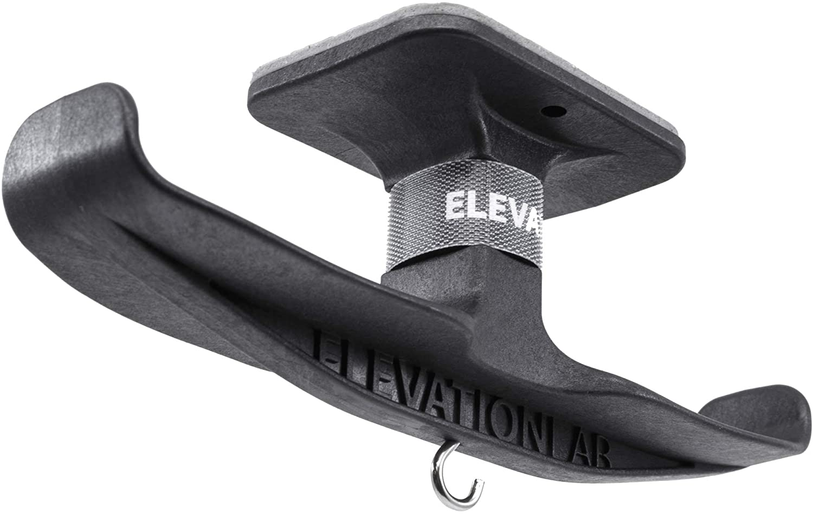

A good pair of headphones is something that every desk studio setup would benefit from. For me they always end up laying around on top of the desk with a long cord getting in my way and even potentially getting caught up in the wheels of my chaior and destroyed.

These days I put an [Elevation Lab Anchor Pro under desk headphone hook](https://amzn.to/2VZsKMx) immediately to any new desk I'll be spending time at. 

They have a slightly less expensive model but the additional heft and cable management features of the Pro are worth the few extra bucks.

I'd highly recommend using the screws as well if possible, because eventually the stickum is going to come lose and topple your headphones to the ground. Better safe than sorry! I learned by experience 😭