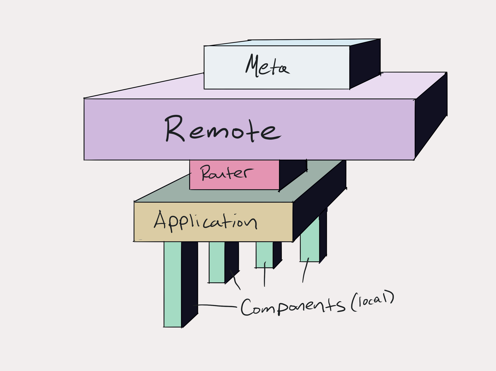

One of the challenges with state management in React is coming to terms and deciding as a team how you will categorize the layers of state in your application. It's variable and often nuanced to describe the layers but framing them in a simple hierarchy is an excellent tool for communicating with your team.

One way to frame these layers of states is using the 5 Layers of State that Jed Watson proposed in his excellent talk [A Treatise on State](https://www.youtube.com/watch?v=tBz3UmZG_bk).
* **Local**: component state using a combination of custom and native React Hooks often in conjunction with [xState as shown in Kyle Shevlin's excellent free egghead course](https://egghead.io/courses/introduction-to-state-machines-using-xstate).
* **Shared**: this is a graph or network of related components that need to share state up to an including the entire application state up at the top of [the potato plant](https://joelhooks.com/react-potato-plant). There is caching involved at this layer of state and often performance concerns. [React Context, custom React Hooks](https://joelhooks.com/react-context) are an excellent combination. xState is also an excellent tool for managing shared application state.
* **Remote**: This is state that the UI doesn't own. It is in The Cloud for all intents and purposes, even if have control over what that means in practical terms. It's async. There is a lot of flexibility at this layer of state and a lot of solutions. GraphQL is a very popular option that will affect the lower levels of state management as well. There are also [excellent React libraries like react-query](https://github.com/tannerlinsley/react-query) [Tanner Linsley](https://twitter.com/tannerlinsley) is somebody to follow if you're interested in these problems) that handle some of the hardest aspects of managing this layer of state such as cache invalidation and future proofing against React Suspense concurrent mode. It's complicated and absolutely where you need to spend the most time researching and communicating to come to a practical solution that suits the needs of your team.
* **Meta**: Is out of your control. You request changes and it might happen. "Might" is always tricky. It's pure and deserves our respect. It's not remote state, but it's intertwined with it very deeply and deserves the same consideration. Coordination, shared understanding, documentation, and communication are essential. "The Business"
* **Router**: This is meta state and is likewise coupled to remote state as well. The Browser. React Router kindly deals with this for us. It's a hard problem and not for the feint of heart.

State management is about coordination and communication and each layer of state relies on mutual agreement at both the code and often more importantly human to human level. Most applications start with local component state and layer on the rest as needed. Research, documentation, and experience will help guide decisions as complexity increases with the needs of the application.

There are [no silver bullets](https://en.wikipedia.org/wiki/No_Silver_Bullet).
