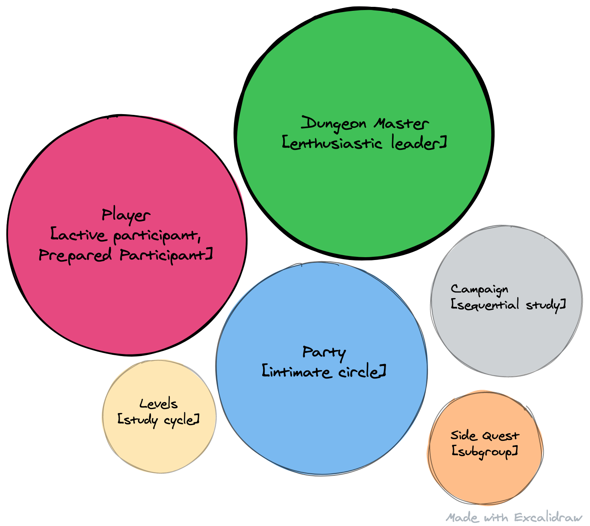

Knowledge Adventure Clubs are the intersection of book clubs and Dungeons & Dragons.

When I was in Jr High I'd show up to school carrying a leather briefcase. Inside of that case there were several thick books, paper, and a bunch of oddly-shaped dice.

I'd sit down at a lunch room table, crack open the briefcase, and spread out my nerdy treasure hoping somebody else would take interest in this fantasy realm with me.

Nobody did 😂

But, for almost 40 years I've been interested in the game of Dungeons & Dragons, or D&D. It's a fascinating table-top, roleplaying game invented in the 70s that has seen a massive resurgence in recent years. D&D provides a ruleset for creating and adventuring in fantastic worlds where your fate is decided by your wits and, often, the roll of a 20-sided dice.

Traditionally, one of the difficult aspects of D&D is finding somebody who is willing to be the dungeon master (DM). This individual organizes the game, sets the stage, and plays the role of "the universe" for the players.

It's a tough job. It's a lot of work. It can also be deeply rewarding and fun, but takes practice and patience. 

Book clubs are easier to understand. If you haven't played D&D, maybe you've participated in a book club.

If not, the concept probably isn't as foreign, but as I was reading this wonderful set of [Alexandrian patterns](https://en.wikipedia.org/wiki/Christopher_Alexander) from Joshua Kerievsky called [Knowledge Hydrant: A Pattern Language for Study Groups](https://www.industriallogic.com/papers/khdraft.pdf) it struck me:

D&D and book clubs are very similar.

The patterns line up. My little diagram captures some of the primary similarities, but you can keep going and the ideas converge in a wonderfully interesting way!

It gets even more interesting when you apply the depth of thought that exists on the internet around designing and running a successful D&D group to creating and running book clubs and study groups. The valuable outcomes are us leveling up in our knowledge and careers.

We can study the patterns of Game Masters to design and faclitate shared-learning experiences that can have a huge impact. 🤯

Here are some of my favorite resources for new Game Masters. If any of this sounds interesting, I'd highly recommend exploring them yourself. If you've never played D&D, don't worry, they don't assume a lot of knowledge. I think you'll "get it" without problem.

* [Running the Game](https://www.youtube.com/playlist?list=PLlUk42GiU2guNzWBzxn7hs8MaV7ELLCP_)
* [Game Angry](https://theangrygm.com/gameangry/)
* [Sly Flourish](https://slyflourish.com/start_here.html)

Recently I've been GMing Knowledge Adventure clubs through some of my favorite frameworks for creating and running an independent business. If you'd like to learn more, you can [click here](https://knowledgeadventure.club)
