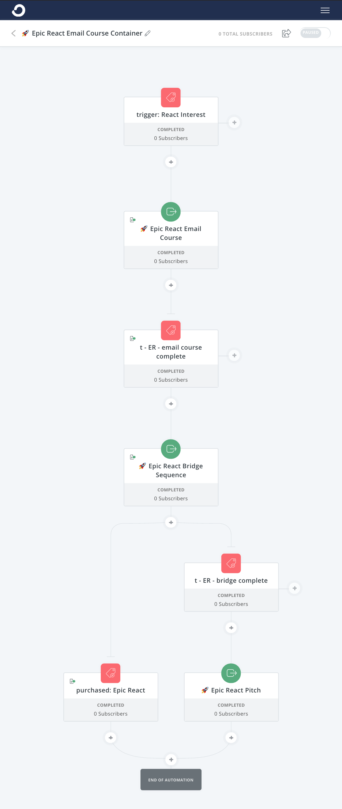
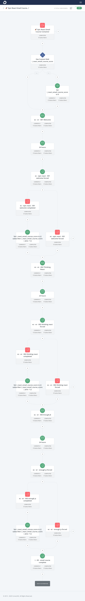
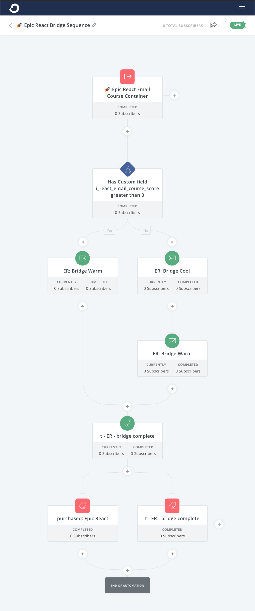
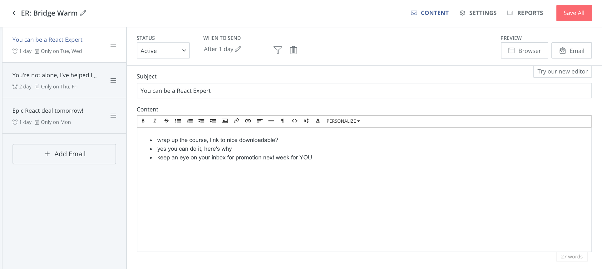
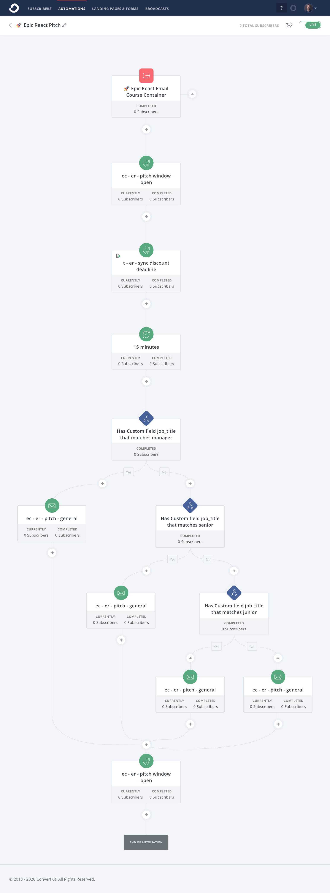
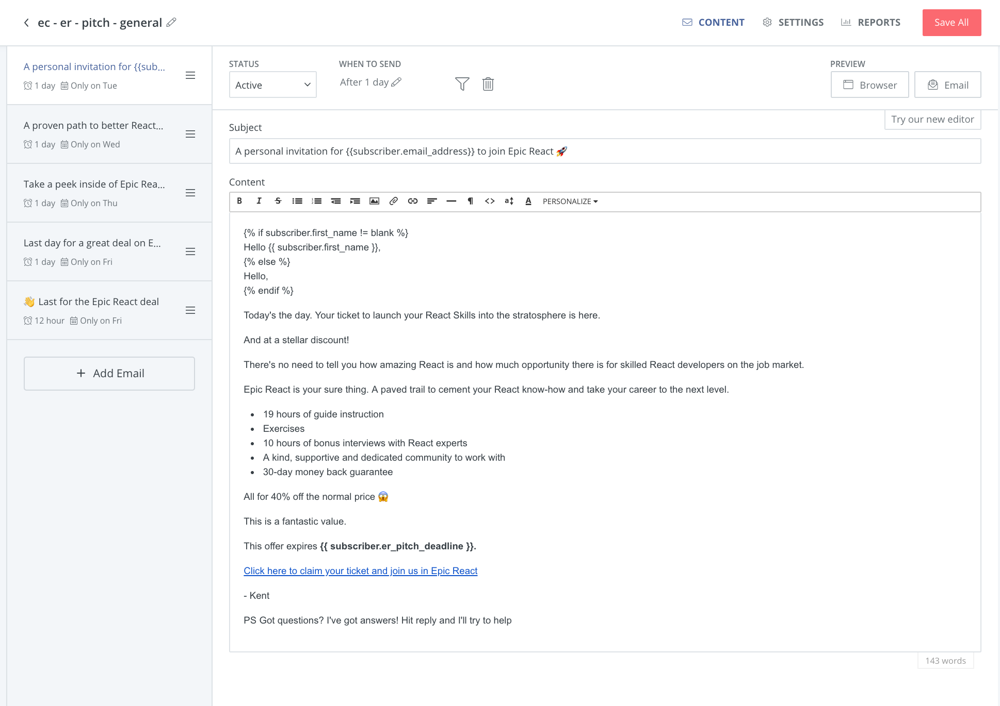

[Convertkit](https://convertkit.com?lmref=ia534A) automations provide a powerful mechanism for delivering [self-paced email courses](/self-paced-email-course) that can transition into an evergreen product pitch and promotion for your product.

A typical approach is to offer some form of **lead magnet** as a **call to action** to attract new subscribers to your email list. Offering a packaged multi-part course in your area of expertise is one type of lead magnet.

An email course is a multi-part educational series delivered to subscribers in their email inbox. This will range from 5-10 emails in length, and is traditionally delivered in a daily cadence so that the subscriber is receiving a new email every day for the course.

This is what we will be building:

* The Self-Paced Email Course
* The Bridge Sequence
* The Evergreen Promotion Sales Pitch

The full automation will consist of these three parts and should provide a consistent, elastic, evergreen promotion for your paid product.

None of this process is a sales trick. This isn't a hustle.

The reason this works is because we are going to layer deep value, insight, and expertise and demonstrate that what we have to sell is absolutely worth the subscribers time and money!

## Self-paced Email Course

Delivering one email a day is fine, but can be frustrating to the subscriber that wants to get all the amazing content and learning material you have to offer **TODAY** and not have it metered out over a week or more.

For us this is a good sign, we want enthusiastic subscribers that are engaged and earnest about learning from the valuable expertise we have to offer.

This is where the **self-paced email course** comes into the equation. Using [Convertkit](https://convertkit.com?lmref=ia534A) automations, we can design a course that allows the subscriber to interact with the material and progress through the course as quickly as they want. Each email will provide a **call to action** that the subscriber can perform to trigger the next email.

The **call to action** can be as simple as clicking a link in the post, or can evolve to more complex solutions such as completing a survey or quiz in another system such as Typeform which coordinates and tags the subscriber using Zapier.

### Hot vs Cold Subscribers

The self-paced email course gives us an indication of the level of interest the subscriber has in the value and expertise we are sharing with them. If they are enthusiastically clicking the links and progressing through the course then we can apply points to a property.

On the other hand, if they aren't interacting with the emails and clicking the CTAs that we provide, they are cooler and we might want to spend more time sharing value with them and making sure our world views are aligned before bridging them directly into a pitch.

For cooler subscribers we will spend a few weeks sending them valuable articles and insights similar to an [evergreen newsletter in Convertkit](/shadow-newsletter-for-evergreen-emails-in-convertkit) framed in the same or similar context as the self-paced email course they've just completed.

For warmer subscribers that have performed the calls to action that we've presented, we want to immediately bridge them into a sales pitch!

## The Bridge Sequence

One common mistake with any email course is to immediately drop into a sales pitch when the subscriber has finished the course. They've received some value from our expertise, so now it's time to pay up! Right?

In fact, this can be like splashing them with cold water and provide a shock to their otherwise eager fingers. If we give them a transition and ease them into the sales pitch, we are more likely to convert them from an email list subscriber enjoying our valuble free content and into a paying customer of our product.

This is what Brennan Dunn describes as the Bridge Sequence in his excellent [Mastering Convertkit course](https://createandsell.co/courses/mastering-convertkit?ref=joelhooks).

A Bridge Sequence is a pause, a breath, between the email course and the actual sales pitch for our paid product. Typically this will be 3 emails long and it will let the subscriber know that a special deal is going to arrive in their inbox in a few days.

1. course wrap up and summary with a heads up about the deal
1. success stories from peers and introduction to the paid product and promotion
1. reminder that the promotion will arrive tomorrow

With these simple emails they are aware, and hopefully excited, that the pitch is headed their way!

## The Pitch Sequence

The bridge sets up the Pitch Sequence. This is where we present a tailored sales pitch that offers the subscriber a chance to buy our paid product with a special discount.

The pitch is timed so that it starts and ends on specific days and times, and on any given week you can have many subscribers receiving the pitch at the same time providing you with active cohorts purchasing your product at the same time.

In the bridge we let the subscriber know when the pitch will arrive, what it will contain, and built a little anticipation about the deal that we are offering.

The pitch itself is a sequence of several emails that describe the offer and present the promotion that looks like a familiar product launch sequence.

1. personalized invitation to take advantage of the promotion
1. encouraging "you can do this and here's why I know it"
1. details about the product itself
1. final day FAQ
1. last chance deal window closing

Note that at any time the subscriber might buy the paid product. This could be during the bridge or the pitch sequence, and if they do we want to end the overall automation.

## Setting it up in Convertkit

To get this running in Convertkit we will be working with three types of automations. 

* Visual Automations: these are flow charts or workflows that allow us to react on events, actions, delays, and conditionals to decide what to do next as the subscriber flows through from self-paced email course to the product pitch.
* Sequences: a Convertkit sequence is a linear series of emails with some rules associated for delivery
* Rules: Convertkit rules are "if this then that" automations that have a trigger and perform an action

We will be using 4 seperate visual automations:

* The Container: This is a top level container for the entire process from when they first subscribe or join the course all the way through the pitch and purchase
* The Self-Paced Email Course: This automation is the email course itself and will handle moving the subscriber from one email to the next and keeping track of their level of interaction
* The Bridge Sequence: Once they are through the course, the bridge will ease them into the pitch
* The Promotion and Pitch: The final CTA where we ask them to invest in our paid product or service with a personalized sales pitch

## The Container Automation

You could do all this in a single automation, but it's not recommended. Convertkit automations are good, but they aren't easy to work with when they start to grow in size. To work around that, we will divide the work into several distinct visual automations which will make the overall process easier to maintain and work with.



At the top of the Convertkit container automation are the triggers that serve as the entry point to the self-paced email course. This might be a tag being added or submitting a form. 

From there we can do any setup that might be required and then move the subscriber into the self-paced email course.

It's important to note that **moving a subscriber to another automation won't stop their progress in the parent automation**. This is why we use events so the subscriber will pause until the event is fired. In this case we are waiting for the `email course completed` event to be triggered and then we will move them to the next step, the bridge, where we will again pause and wait for the appropriate event to fire.

## Setup The Self-Paced Email Course in Converkit

The first sub-automation is the self-paced email course itself:



When the subscriber enters the course we set a `course score` property and intialize it to 0.

With each email they recieve they can be tagged with either `{email} completed` or `{email} force completed`. The `completed` tag means they interacted with the email and accomplished the task we provided via a CTA. The `force completed` means that a 24-hour delay occured. Both of these tags will advance the subscriber to the next email in the sequence until they reach the end and the `email course completed` tag is applied.

note: unfortunately Convertkit doesn't allow you to send single emails within a visual automation so each email in the self paced course is a sequence set to send 1 email immediately.

Each time the `completed` tag is applied we also add 1 point to their `course score` so that we can use that number later to determine their level of engagement.

Once the `email course completed` tag is applied the subscriber is advanced in the course container. If their `course score` is greater than 1, we move them into the bridge sequence immediately, otherwise we send them into a few weeks of evergreen newsletter to further align and let them know what we have to offer.

## The Bridge Automation in Convertkit

Now that we've completed the course we are ready to send them into a transitionary bridge sequence:



The bridge sequence itself is much simpler than the self-paced email course. We check their score, and send them directly into the bridge if they are engaged. If they aren't engaged we send them into a cool sequence before the bridge so that they can have the opportunity to decide if they are aligned with what we have to offer.



The bridge consists of three emails.

**Email 1**: This will be sent after 1 day, but only on Tuesday or Wednesday. We restrict it to these days so that we have full control over when our sequences will run and can do date math and use correct language. "You can expect this deal next Tuesday!" in this case.

**Email 2**: This will be sent after 2 Days, but only on Thursday or Friday. This email is similarly restricted so that we are coherently speaking about when in the future the subscriber can expect their promotion.

**Email 3**: This will be sent after 1 day, but only on Monday. This is a quick reminder to be on the lookout for the deal "tomorrow".

One cool tactic that Brennan recommends in [Mastering Convertkit](https://createandsell.co/courses/mastering-convertkit?ref=joelhooks) is to give the subscriber a chance to get reminded via SMS when the deal starts. People actually appreciate this in many cases and SMS has a very high conversion rate! I haven't tried it yet, but it's on my list 😅

## Implementing the Pitch Automation in Convertkit

They've been through the course. We've provided a smooth transition via the bridge.

Now it's time to make the offer.



The pitch is our opportunity to convert a subscriber into a paying customer and is the climax of the entire process. This is it. This is where we eat.

How the pitch works will depend largely on your product and the infrastructure that you have in place. There are many different ways to approach this. For my particular context I want to create an expiring single use coupon code and update the subscriber's properties with that code as well as some helper text that can be used to display when the deal will end in plain English.

When the subscriber enters the pitch automation two tags are applied

* `pitch open`: this tag is so you can filter and and not send them any other emails during a pitch. Eye on the price here.
* `sync deadline`: this triggers a rule that fires a webhook that my Ruby on Rails backend recieves for the user.

The webhook creates a coupon code, does the date math, and updates the subscriber's properties with those fields.

```ruby
class ConvertkitEventsController < WebhookBaseController
  def deal_open
    subscriber_id = params[:subscriber][:id]

    Chronic.time_class = Time.zone
    friday_midnight = Chronic.parse('this saturday 01:59:59') # we are central

    coupon = Coupon.create(
      percent_off: 0.4,
      max_uses: 1,
      expires_at: friday_midnight.to_i,
    )

    ConvertKit.put("/subscribers/#{subscriber_id}", query: {
      fields: {
        coupon_code: coupon.code,
        coupon_expires: friday_midnight.to_i,
        discount_url: "http://example.com?coupon=#{coupon.code}",
        pitch_deadline: friday_midnight.strftime("%A %B %e %Y at %I:%M %p Pacific")
      }
    })
    
    head :ok
  end
end
```

This is a slimmed down version of what the actual webhook handler looks like on the server. Using this approach is fancy and requires technical infrastructure and is not required at all. It's nice because the deal is restricted and we won't have coupon codes floating around on the internet. It also provides some flexibility for future enhancements and would allow us to set other properties to layer more personalized context as needed.

### Personalizing the Pitch

Another aspect of the pitch automation is that there are several branches. At various stages of the self-paced email course and through other interactions with the user we've collected some information. In our case we've asked them to identify themselves as:

* novice
* junior
* senior
* manager

What this allows us to do is tailor a more personalized pitch to their actual context as each of these will have different wants and needs when it comes to the actual product and we can address those in the pitch.

This branching can get more complex and personalized! Additionally, if you have more data points you can use `if/else` branching in the emails themselves to further tune the language to personalize the pitch even further.

It's smart to start simple and iterate on personalization over time. There's already quite a bit going on here, so ease into it.

### The Pitch Email Sequence in Converkit

The pitch sequence itself consists of 5 emails. The first is set to go on Tuesday morning and the rest follow through Friday



At each step we are able to access the properties that we set and link to deal that we are offering.

If everything goes well, we should have several people every week receiving and buying the offer. In our case, this means that we will have consistent cohorts to onboard that will be able to join in on group activities and otehr community focused opportunities.

## A Video Tour of this Implementation

You can [click here if you'd like a narrated video tour of this self-paced email course and pitch automation in ConvertKit](https://www.loom.com/share/cf916473a62b42019d5ee7f9366c739e) I'm describing. 

We are using this for https://epicreact.dev

## "I don't have a product to sell!"

If you don't have a product to sell then you might consider just setting up the self-paced email course in [Convertkit](https://convertkit.com?lmref=ia534A). It's a great way to provide your subscribers value and show them what you have to offer as an expert. Later on you can always add the additional automations for the bridge and pitch sequences.

## Where to go from here?

If you haven't tried out [Convertkit](https://convertkit.com?lmref=ia534A) or don't have an email list, that is absolutely the place to start. [Convertkit offers a free plan](https://app.convertkit.com/users/signup?plan=free-limited&lmref=ia534A) if you want to start there, but it doesn't have all the features required to setup this self-paced email course and evergreen pitch automation.

The self-paced email course and evergreen pitch automation above is derived from [Brennan Dunn's amazing in-depth Mastering Convertkit class](https://createandsell.co/courses/mastering-convertkit?ref=joelhooks). Brennan's course is step by step and provides a huge amount of tactics and strategy that will keep you iterating for years. It's an investment, but for me it's paid itself off over, and over, and over again so if you are selling digital products online I recommend the course whole heartedly! Fantastic stuff.

You might also be interested in [this other post on self-paced email courses](/self-paced-email-course) that covers how I implemented "just the course" for Just JavaScript with Dan Abramov!

_I use affiliate links liberally in this post to [Brennan's Mastering Convertkit](https://createandsell.co/courses/mastering-convertkit?ref=joelhooks) and [Convertkit](https://convertkit.com?lmref=ia534A) itself. Feel free to Google them if you'd prefer I not get paid anything!_