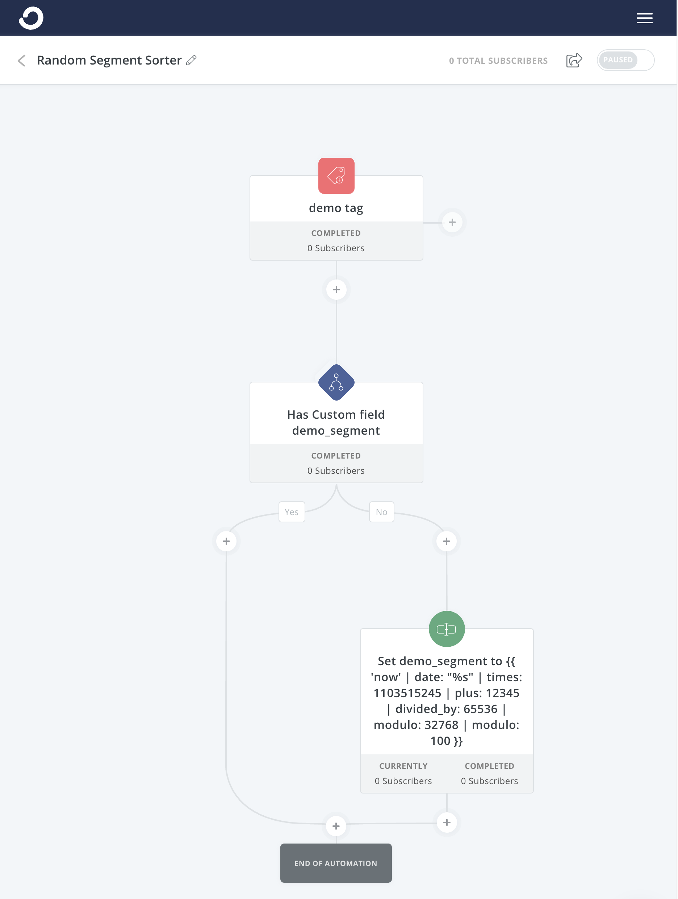

If you want to generate a (pseudo) random number using a Liquid filter in [Convertkit](https://convertkit.com?lmref=ia534A), here's the code:

```
{{ 'now' | date: "%s" | times: 1103515245 | plus: 12345 | divided_by: 65536 | modulo: 32768 | modulo: 100 }}
```

## What's actually going on here?

This is a complex liquid template, so let's break it down, starting from the right and working our way left.

### using modulo in liquid

The [modulo](https://en.wikipedia.org/wiki/Modulo_operation) of a number is the remainder of a math operation.

The `modulo: 100` affects the range. Using `100` will give you a result **between** 0-100. If you wanted a number between 0-10, use 10.

### Liquid Math

`times`, `plus`, and `divided_by` are fairly straight forward mathematics for multiplication, addition, and division respectively. The actual values of these numbers is frankly a bit of arcane "magical" number fuckery, that I don't personally understand, which is to say I just googled it.

If you are very curious about WHY this works, this sequence of numbers is [linear congruential generator](https://rosettacode.org/wiki/Linear_congruential_generator) that produces a pseudo-random number 🤔

### Using the date as a seed

`'now' | date: "%s"` is parsed by liquid as the current seconds of "now", which is the "seed" for our random number generator where the seconds are the actual seconds between now and 1970 often referred to as ["epoch" or UNIX time](https://en.wikipedia.org/wiki/Unix_time).

## Using the random number in Convertkit Automations

My specific use case for this was sending automations to a fraction of a group for testing because [ConvertKit](https://convertkit.com?lmref=ia534A) automation do not have a built in way to accomplish this.

Here's the basic automation:



1. The automation is triggered.
1. We check to see if the custom property as a value, in this example it is `demo_segment`
1. If it isn't set, we add a value to `demo_segment` using our liquid template
as the field value.

Now your subscriber will have a value between 0-100 that you can use to segment them.


For me, I am sending a sequence to a small percentage to verify some functionality during a pre-sale and we've learned from past experience (😅) that it's smart to send to a small group before blasting thousands of people with potentially broken links or functionality.

I'll start with 2%, then up that to 8%, 10%, 20%, 50%, 80%, 100% just reflowing subscribers through the automation as needed since we are guaranteed in [Convertkit](https://convertkit.com?lmref=ia534A) that any given email won't be sent twice if it's in a Sequence.

Works great!

You may also like this post that discusses **[using ConvertKit automation to create self-paced email courses for evergreen product pitches](https://joelhooks.com/self-paced-email-course-convertkit)**.