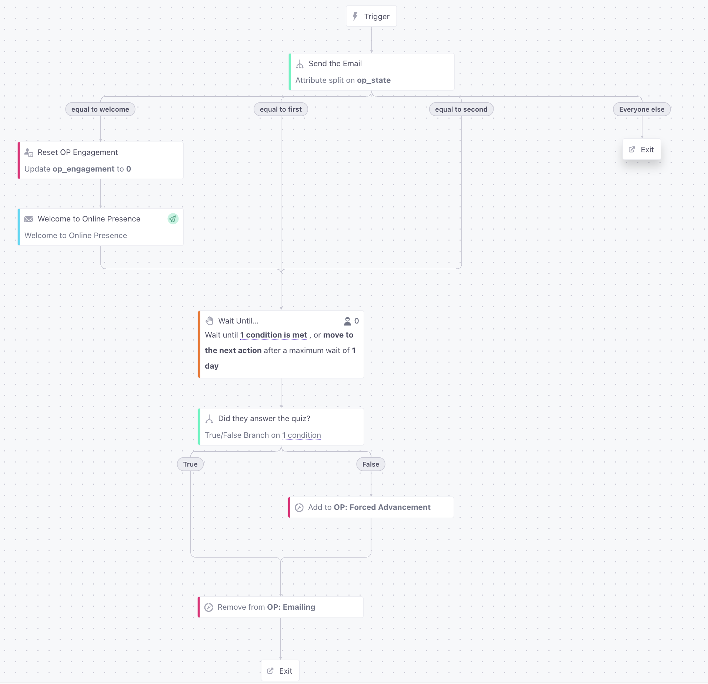
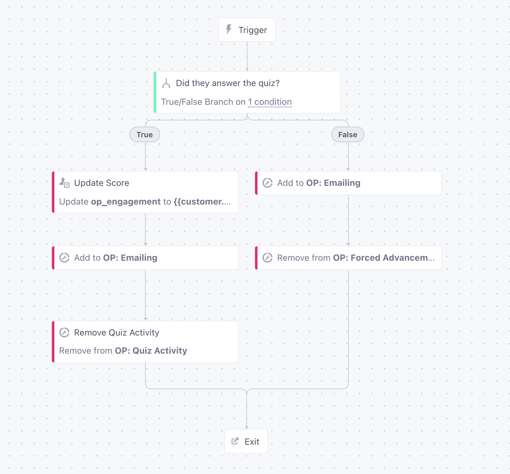

I split this into two campaigns and multiple segments for clarity. 

This lets me loop through the logic instead of "stacking" a bunch of repetition in a single campaign. I'm not sure if this is technically fine in CIO and haven't tested it yet.

**Course: Emailing** and **Course: Progress**

Course: Emailing workflow is triggered by adding a user to the "C: Emailing" segment. It's manual so we can control how the customer flows from campaign to campaign.

It uses the switch case node and looks at a "state" property that is set externally and emails the appropriate branch based on that value, or exits cold if it doesn't exist (note the empty branches will have emails)

After the email is sent, it waits for 24 hours unless the customer enters the segment "C: Quiz Activity". If they don't do anything they are added to the segment "C: Forced Advancement"

In both cases the "C: Emailing" segment is removed after the "wait until" is completed.

"C: Quiz Activity" and "C: Forced Advancement" both send the customer to Course: Progress campaign. This campaign does a little house keeping, updates the "engagement attribute" if they did the quiz, and adds them back to "C: Emailing" segment before removing the segment that they arrived in this campaign with.

It's assumed that the "op_state" will be updated accordingly from an external source so the user will be routed to the right "channel" in the Emailing workflow.

The looping seems to make sense but is probably the weirdest part of the overall flow but the "switch/case" node is too good to pass up for a little state machine type workflow.