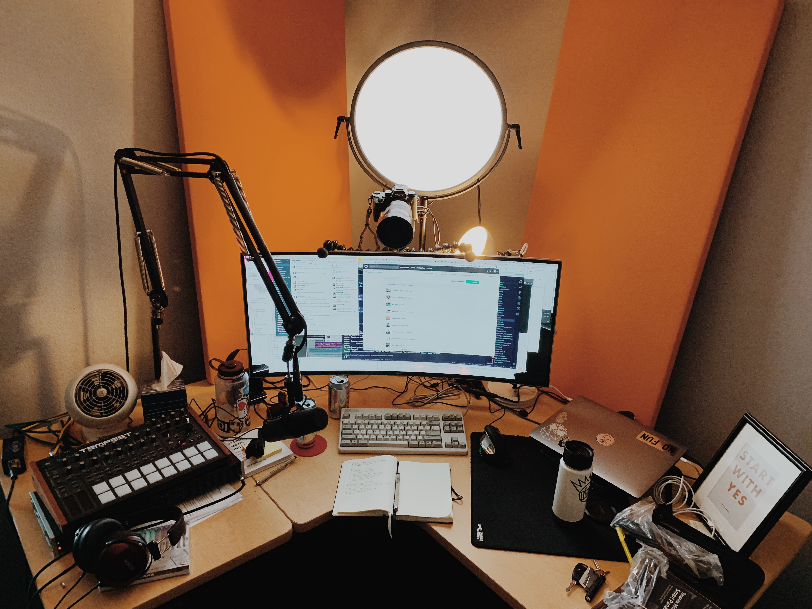

I've been spending a lot more time lately on camera broadcasting over the internet. This includes general individual video calls, and also a recent adventure into live streaming for an audience.

For years I've been true and loyal to Logitech HD web cams. They aren't bad, cost about \$100, and generally give you enough quality to get by for video calls. I also combined the Logitec with an application called iGlasses that gives you color controls over the webcam, so my photo quality nerd itch was scratched enough to tolerate.

But there is a LOT of room for improvement, and since I've been living the dream as an honest to goodness video blogger I decided to upgrade.

I've got some experience in photography and video production, and also happen to have several high quality dSLR cameras on hand.

Wouldn't it be cool to get the power and flexibility of a dSLR for video broadcasting over the internet?

## Capturing video

To use an SLR as a webcam it needs "clean" HDMI output. Clean means that the HDMI signal doesn't have text overlays displaying various settings. Makes sense, that'd look really bad.

I'm using my [Sony Alpha a9](https://www.amazon.com/exec/obidos/ASIN/B06ZY7GNKN/joehoobuiblo-20/ref=nosim/) as a webcam. It's a delightful camera body that takes amazing still photos as well as being an super awesome pro style video camera.

It's also kind of ridiculous to use for this use case, but it fits the criteria and I already own it, so there it is.

This is definitely not the only option. [The Panasonic Lumix G85](https://www.amazon.com/exec/obidos/ASIN/B01M050N05/joehoobuiblo-20/ref=nosim/) is a great camera that will serve this purpose very well also.

I also used my [GorillaPod 5k](https://www.amazon.com/exec/obidos/ASIN/B074WG19MP/joehoobuiblo-20/ref=nosim/) to mount the camera to my monitor. I will probably find a better stand for it at some point, but this worked very well.

## The Webcam Adapter

Now that you've got a nice camera with clean HDMI out, you need to have it recognized as a webcam. Simply plugging it in to the USB port won't work, it needs to have a device in between to "trick" the computer into seeing the HDMI signal as a webcam.

At the low-end, the [elgato Cam Link 4k](https://www.amazon.com/exec/obidos/ASIN/B07K3FN5MR/joehoobuiblo-20/ref=nosim/) is effective and simple. It has an HDMI port on one side and a USB port on the other. When you plug the camera into the hdmi port and the usb into the computer, your SLR will show up as a webcam. ez

If you want to kick it up a notch, the [Blackmagic Web Presenter](https://www.amazon.com/exec/obidos/ASIN/B07K3FN5MR/joehoobuiblo-20/ref=nosim/) is a great upgrade. It gives you multiple input options and even lets you switch between inputs. It is also a USB interface for audio equipment, so you can hook your mic into it as well. Similar to the elgato, you just need to plug in the HDMI in and connect the USB to the computer and it "just works". Note that you need to buy both a power cable and a usb cable for this thing. They don't come included and that can be annoying.

## Lights!

To get a good picture you absolutely need to supplement your lighting. These days there is a great selection of LED lights that work as a softbox.

There's a LOT of garbage in this space, so watch out for the cheap stuff. I went for the [FotodioX FlapJack](https://www.amazon.com/exec/obidos/ASIN/B013TSPWXO/joehoobuiblo-20/ref=nosim/), and it is really great. It lets you control the temperature and the brightness is just right for a desktop situation.

You'll probably want a light stand for the light as well, and [this little one](https://www.amazon.com/exec/obidos/ASIN/B001D2GQ8Y/joehoobuiblo-20/ref=nosim/) fit well on my desk.

It's a good start. The simple webcam works well, and it fits my primary application use case (Zoom) perfectly. Down the road I will probably consider several things to really kick it up a notch. A dedicated streaming PC to handle all of the heavy processing, and there is a lot of interesting gear for managing that solo thanks to the popularity of game streaming. I'm also going to rack mount a lot of the audio gear and other bits and do a nice round of cable management.

[Hit me up on twitter](https://twitter.com/jhooks) if you have any questions.
